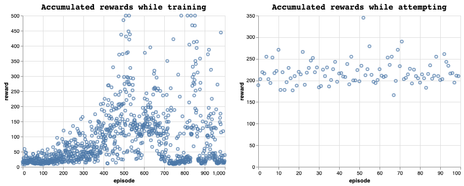

# Reinforcement Learning With Function Approximation

This repository explores the stability of several agents using Q-Value function approximation. It also includes the `gym_runner` pacakge that implements neccessary functionality to test agents trained with each of the algorithms listed below. it also implements grid searching over agent and Q-value function hyperparameters in the `gym_funner.grid_search` module.

## Current RL Algorithms:

* SARSA
* Q-Learning
* Q-Learning with Memory Replay

## Current Function Approximations

* 2 Layer NN with Tanh and relu activations
* 3 Layer NN with Relu activations
* 3 Layer NN with Relu activations

There is also a base class for making arbitrary Q-Function approximation objects.

After finding optimal hyper parameters for the Cart Pole environment, as measured by average testing score over 5 independently trained agents, the Q-Learning with Experience Replay agent was deemed best. the chart below shows training and testing accumulated rewards over one run.

The hyper parameters for this agent are listed below:

* Agent Parameters:
  * gamma (future state-action value discount rate): .95
  * epsilon (probability of randomly selecting an action): 1.0
  * epsilon decay: .998
  * minimum epsilon during training: .1
* Q-Function parameters:
  * two hidden layers of dimensions 24, 48 respectively
  * activations : tanh
  * optimizer: Adam
  * loss function: mse
  * alpha (learning rate): .001
  * weight decay = .01
